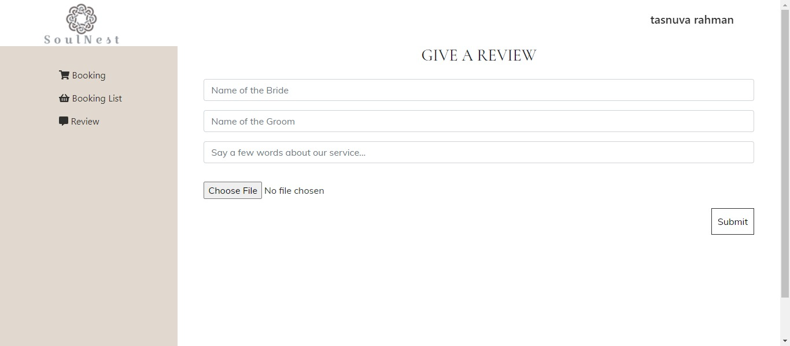

# SoulNest-wedding photography website
Wesite link : https://soulnest-wedding-photography.web.app/

A web  application created with html,css,javascript,react,react-bootstrap,node js,express js,mongodb.

## Features
SoulNest is an wedding photography website.On the home page user can see a top carousel,their authentic photographs,services they offers,their vediography example,dynamic customer reviews,a contact form and footer. if a user is logged in he can visit the user dashboard where he can purchase a service via credit card ,see this booking lists and add reviews.These added reviews will be directly shown to home page.if an admin is logged is he can visit the user dashboard and admin dashboard as well.On the admin dashboard admin can add new service, manage or delete them.he can also add new admin and change the status of any customres services using drop down menu.

## Tech/framework used

<b>Built with</b>

* html
* css
* javascript
* react
* react-router
* react-bootstrap
* node js
* express js
* mongodb
* firebase
* heroku
 
## Screenshots

## Installation and Setup Instructions

Clone down this repository. You will need `node` and `npm` installed globally on your machine.  

Installation:

`npm install`  

To Run Test Suite:  

`npm test`  

To Start Server:

`npm start`  

To Visit App:

`localhost:3000/ideas` 

## API Reference

API link : https://limitless-peak-51272.herokuapp.com/

## How to use 

* Go to the website ***home*** to view our services,photographs,vediographs,reviews,prtners and contact form.
* Click on the ***Purchase*** button to book a service you prefer.
* if you are not logged in already ,Please ***Log in*** to book service.
* if you are logged in in will take you directly to ***Booking*** page on ***user*** dashboard.Where you can book aservice using valid credit card
* On the user dashboard click on ***Booking List*** link to see and review all the order you have placed so far.You give reviews on ***review*** section .
* On the ***Admin*** page you will have three options to **Add Service**, **Add Admin** **Manage Service** and **Manage Product**.

## Credits
I have done this project as an assignment of programming hero web development course. Most of the technologies I have used here is taught by our respectable instructor Jhankar Mahbub.

## License

© [Tasnuva Rahman](https://github.com/tasnuvatina)